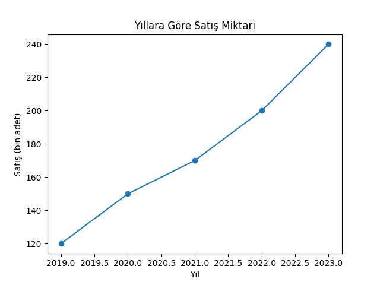

# Giriş — Veri Görselleştirmenin Temelleri

Bu bölümde veri görselleştirmenin ne olduğu, neden önemli olduğu ve etkili görselleştirme tasarımlarının temel ilkeleri ele alınır. Amaç, okuyucuya sadece araç kullanımı değil; aynı zamanda **veriyi doğru, anlaşılır ve etkili biçimde sunma** bilincini kazandırmaktır.

---

## 🎯 Öğrenme Hedefleri

* Veri görselleştirmenin amacını ve önemini kavramak
* Etkili bir görselleştirmenin temel ilkelerini tanımak
* Yaygın hatalı grafik türlerini fark etmek
* Görsel algının veri yorumuna etkisini anlamak

---

## 📊 Veri Görselleştirme Nedir?

**Veri görselleştirme**, verileri grafik, tablo veya görsel biçimlerde sunarak bilgi ve içgörü elde etmeyi kolaylaştıran bir süreçtir. İnsan beyni, sayısal veriden çok görsel bilgiyi daha hızlı işler. Bu nedenle grafikler, karmaşık veri kümelerini anlamamıza yardımcı olur.

Örnek:

```python
import matplotlib.pyplot as plt

years = [2019, 2020, 2021, 2022, 2023]
values = [120, 150, 170, 200, 240]

plt.plot(years, values, marker='o')
plt.title('Yıllara Göre Satış Miktarı')
plt.xlabel('Yıl')
plt.ylabel('Satış (bin adet)')
plt.show()
```
  
Bu örnek, yıllara göre satış trendini hızlıca anlamamızı sağlar.

---

## 💡 Neden Önemlidir?

Veri görselleştirmenin temel işlevleri:

1. **Anlamayı kolaylaştırır:** Karmaşık veriler sadeleştirilir.
2. **İletişimi güçlendirir:** Bulgular hedef kitleye etkili biçimde aktarılır.
3. **Karar verme sürecini destekler:** Eğilimler ve ilişkiler daha net görülür.
4. **Hataları ve anomalileri ortaya çıkarır:** Veri içindeki aykırılıklar görsel olarak fark edilir.

---

## 🧠 Görsel Algı ve Tasarım İlkeleri

Veri görselleştirmede estetik kadar **algısal doğruluk** da önemlidir. Tasarım ilkeleri:

* **Basitlik:** Gereksiz öğelerden kaçının.
* **Tutarlılık:** Renk, ölçek ve biçim tutarlılığı koruyun.
* **Denge:** Görsel öğeleri simetrik ve okunabilir yerleştirin.
* **Vurgu:** Ana mesajın öne çıkmasını sağlayın.
* **Renk Kullanımı:** Az ve anlamlı renklerle bilgi iletin.

> ⚠️ Örnek: Pasta grafikleri yerine çoğu durumda çubuk grafik kullanmak oran farklarını daha doğru gösterir.

---

## ❌ Hatalı Görselleştirme Örnekleri

* Eksen ölçeklerinin sıfırdan başlamaması
* Orantısız 3B grafik kullanımı
* Aşırı renk ve efekt kullanımı
* Çok fazla bilgiyle kalabalıklaştırılmış grafikler

---

## 📈 Örnek Uygulama: Basit Karşılaştırma Grafiği

```python
import matplotlib.pyplot as plt

departments = ['Satış', 'Pazarlama', 'Üretim', 'AR-GE']
values = [250, 180, 320, 150]

plt.bar(departments, values, color=['#4e79a7', '#f28e2b', '#e15759', '#76b7b2'])
plt.title('Departman Bazlı Yıllık Harcama')
plt.ylabel('Bin TL')
plt.show()
```

Bu tür basit görselleştirmeler, bölümler arası farkları kolayca göstermeye yardımcı olur.

---

## 📚 Ek Kaynaklar

* [Python Matplotlib Dokümantasyonu](https://matplotlib.org/stable/contents.html)
* [Seaborn Galerisi](https://seaborn.pydata.org/examples/index.html)

---

> Güncel sürüm: v1.0 — Kasım 2025
