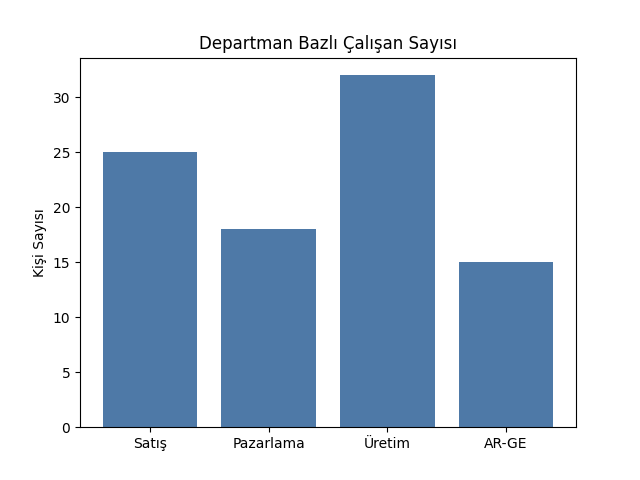
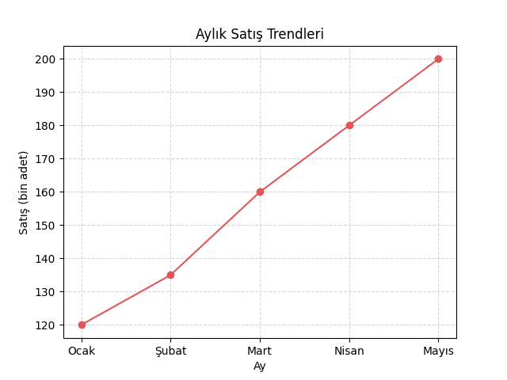

# Grafik Türleri ve Kullanım Amaçları

Bu bölümde farklı veri türlerine ve analiz amaçlarına göre kullanılabilecek grafik türleri ele alınır.  
Amaç, doğru veri için doğru grafik seçimini yapabilmeyi sağlamaktır.

---

## 🎯 Öğrenme Hedefleri

- Grafik türlerini ve kullanım amaçlarını tanımak  
- Veri türlerine göre uygun grafik seçimini öğrenmek  
- Hatalı grafik seçimlerinin bilgi iletimini nasıl bozduğunu fark etmek  

---

## 📊 Grafik Türlerinin Sınıflandırılması

Genel olarak grafikler **veri türüne** ve **amaçlarına** göre sınıflandırılabilir.

| Veri Türü | Önerilen Grafik Türleri | Kullanım Amacı |
|------------|------------------------|----------------|
| **Kategorik** | Çubuk (bar), Pasta (pie), Sayım (countplot) | Gruplar arası karşılaştırma |
| **Sürekli (nicel)** | Çizgi (line), Histogram, Yoğunluk (density) | Dağılım, eğilim, değişim gösterme |
| **Zamana Bağlı** | Çizgi (line), Alan (area) | Zaman içindeki değişimi izleme |
| **İki Değişkenli** | Dağılım (scatter), Regresyon | İlişki ve korelasyon analizi |
| **Coğrafi** | Harita (map, choropleth) | Bölgesel dağılım gösterimi |

---

## 💡 Doğru Grafik Seçimi

Grafik türü seçimi, **veri türü**, **karşılaştırma amacı** ve **hedef kitlenin** bilgi düzeyi dikkate alınarak yapılmalıdır.

**Örnekler:**

- Bir şirketin departman bazında çalışan sayısını göstermek için → **Çubuk Grafik**
- Bir ürünün aylık satış eğilimini göstermek için → **Çizgi Grafik**
- Bir sınıftaki not dağılımını görmek için → **Histogram**
- İki değişken arasındaki ilişkiyi incelemek için → **Dağılım (Scatter) Grafiği**

---

## 📈 Örnek Uygulama: Çubuk Grafik

```python
import matplotlib.pyplot as plt

departments = ['Satış', 'Pazarlama', 'Üretim', 'AR-GE']
values = [25, 18, 32, 15]

plt.bar(departments, values, color='#4e79a7')
plt.title('Departman Bazlı Çalışan Sayısı')
plt.ylabel('Kişi Sayısı')
plt.show()
```
  
Bu görselleştirme, farklı bölümler arasındaki personel dağılımını doğrudan karşılaştırmayı kolaylaştırır.

---

## 📉 Örnek Uygulama: Çizgi Grafik

```python
import matplotlib.pyplot as plt

months = ['Ocak', 'Şubat', 'Mart', 'Nisan', 'Mayıs']
sales = [120, 135, 160, 180, 200]

plt.plot(months, sales, marker='o', color='#e15759')
plt.title('Aylık Satış Trendleri')
plt.xlabel('Ay')
plt.ylabel('Satış (bin adet)')
plt.grid(True, linestyle='--', alpha=0.5)
plt.show()
```
  
Zaman serisi grafiklerinde eğilimleri görmek, karar süreçlerinde önemli içgörüler sağlar.

---

## ⚠️ Yaygın Hatalar

- Yanlış grafik seçimi: Sürekli veriyi pasta grafikle göstermek
- Eksensiz karşılaştırma: Eksen başlangıcını sıfırdan başlatmamak
- Aşırı renk kullanımı: Görsel karmaşa yaratmak
- 3B etkiler: Oran farklarını yanıltıcı hale getirmek

## 📚 Ek Kaynak
- [Matplotlib Grafik Gallerisi](https://matplotlib.org/stable/gallery/index.html)