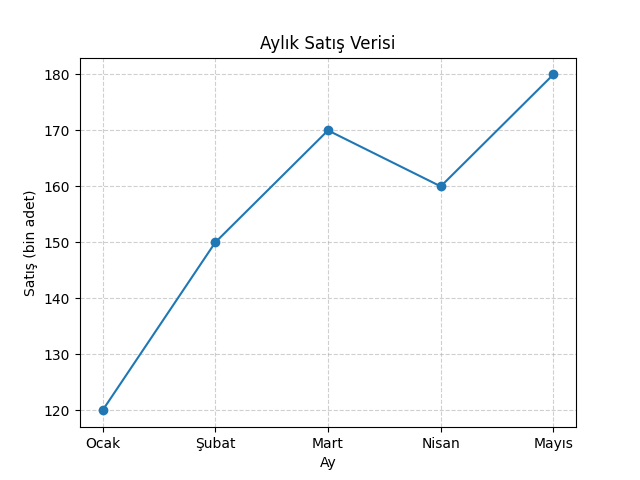

# Anaconda Kurulumu ve Temel DataFrame İşlemleri

Bu bölümde Python veri analizi ortamının kurulumu ve pandas kütüphanesi ile temel **DataFrame** işlemleri ele alınır. Amaç, veri görselleştirme uygulamalarında kullanılacak verilerin nasıl hazırlanacağını öğrenmektir.

---

## 🎯 Öğrenme Hedefleri

- Anaconda ve Jupyter Notebook ortamını kurmak  
- Veri dosyalarını okumak ve DataFrame’e aktarmak  
- Temel veri inceleme ve düzenleme işlemlerini yapmak  
- Görselleştirme öncesi veri temizliği hakkında fikir sahibi olmak  

---

## ⚙️ Anaconda Nedir?

**Anaconda**, veri bilimi ve makine öğrenmesi için sık kullanılan Python dağıtımlarından biridir. İçinde Jupyter Notebook, pandas, matplotlib, seaborn gibi pek çok kütüphane önceden kurulu gelir.

### 💾 Kurulum Adımları (Kısaca)
1. [anaconda.com](https://www.anaconda.com/products/distribution) adresinden sisteminize uygun sürümü indirin.  
2. Kurulum sihirbazını varsayılan ayarlarla tamamlayın.  
3. Kurulumdan sonra “Anaconda Navigator” veya “Jupyter Notebook” uygulamasını açın.  
4. Terminalden Jupyter başlatmak için:
   ```bash
   jupyter notebook
   ```
5. Tarayıcıda `http://localhost:8888` adresi açılırsa ortam hazır demektir.

---

## 🧭 Jupyter Notebook Hakkında Kısa Bilgi

Jupyter Notebook, kod, metin, denklem ve görselleştirmeleri aynı dosyada birleştirmenize olanak tanır.

**Hücre Türleri:**
- **Code:** Python kodları yazmak için kullanılır.  
- **Markdown:** Açıklama, başlık, formül yazmak için kullanılır.  

> 💡 İpucu: Hücre çalıştırmak için `[Shift] + [Enter]` tuşlarını kullanın.

---

## 🧮 pandas ile DataFrame Oluşturma

```python
import pandas as pd

# Basit bir DataFrame örneği
data = {
    'Ad': ['Ali', 'Ayşe', 'Mehmet', 'Zeynep'],
    'Yaş': [23, 25, 22, 24],
    'Bölüm': ['Bilgisayar', 'Matematik', 'Fizik', 'İstatistik']
}

df = pd.DataFrame(data)
print(df)
```

**Çıktı:**
```
       Ad  Yaş      Bölüm
0     Ali   23  Bilgisayar
1    Ayşe   25  Matematik
2  Mehmet   22      Fizik
3  Zeynep   24  İstatistik
```

---

## 📁 CSV Dosyasını Okuma

```python
# CSV dosyasını okuma
veri = pd.read_csv('ornek_veri.csv')

# İlk 5 satırı görüntüleme
veri.head()
```
> [!NOTE]
> Burada kullanılan `ornek_veri.csv` dosyası ile `Jupyter Notebook` dosyası aynı klasöründe yer almalıdır.

---

## 🔍 Temel DataFrame İşlemleri

| İşlem | Komut | Açıklama |
|--------|--------|----------|
| Boyut | `df.shape` | Satır ve sütun sayısını verir |
| Sütunlar | `df.columns` | Tüm sütun isimlerini listeler |
| Türler | `df.dtypes` | Veri türlerini gösterir |
| Tanımlayıcı istatistikler | `df.describe()` | Ortalama, min, max, std hesaplar |
| Sıralama | `df.sort_values('Yaş')` | Belirli bir sütuna göre sıralar |
| Filtreleme | `df[df['Yaş'] > 23]` | Şarta göre satır seçer |

---

## 🧹 Basit Veri Temizliği

```python
# Eksik verileri tespit etme
print(df.isnull().sum())

# Eksik verileri doldurma
# Örnek: Yaş sütunundaki eksik değerleri ortalama ile doldur
mean_age = df['Yaş'].mean()
df['Yaş'].fillna(mean_age, inplace=True)
```

Bu işlemler görselleştirme öncesi veri hazırlığında sıkça kullanılır.

---

## 📈 Uygulama: Küçük Bir Örnek

```python
import matplotlib.pyplot as plt
import pandas as pd

# Basit veri seti
data = {
    'Ay': ['Ocak', 'Şubat', 'Mart', 'Nisan', 'Mayıs'],
    'Satış': [120, 150, 170, 160, 180]
}

df = pd.DataFrame(data)

plt.plot(df['Ay'], df['Satış'], marker='o')
plt.title('Aylık Satış Verisi')
plt.xlabel('Ay')
plt.ylabel('Satış (bin adet)')
plt.grid(True, linestyle='--', alpha=0.6)
plt.show()
```
  
Bu örnek, pandas DataFrame verisinin doğrudan matplotlib kullanılarak nasıl görselleştirileceğini gösterir.

---

## 📚 Ek Kaynaklar

- [Anaconda Distribution](https://www.anaconda.com/products/distribution)  
- [Jupyter Project](https://jupyter.org/)  
- [pandas Documentation](https://pandas.pydata.org/docs/)  
- [DataFrame İşlemleri](https://github.com/abdullatifkaban/Machine-Learning/blob/main/Data-Preprocessing/01-DataFrame-Operations/DataFrame-Operations.ipynb)
