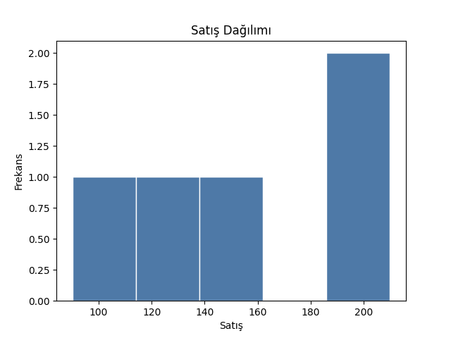
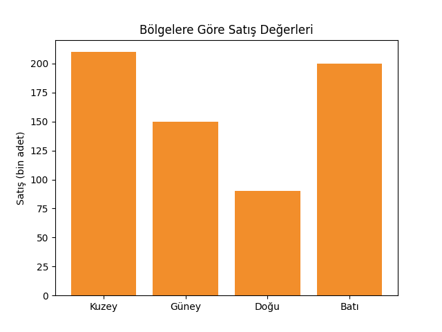
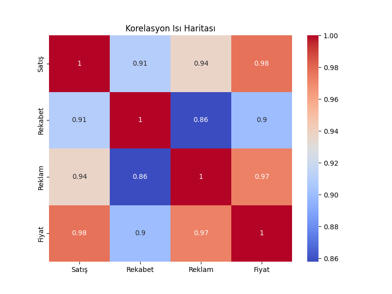

# Keşfedici Veri Analizi (EDA)

Bu bölümde **Keşfedici Veri Analizi (Exploratory Data Analysis - EDA)** kavramı ele alınmaktadır.
Amaç, görselleştirme veya modelleme öncesinde veriyi tanımak, özetlemek ve olası sorunları tespit etmektir.

---

## 🎯 Öğrenme Hedefleri

* EDA kavramının amacını ve kapsamını anlamak
* pandas kütüphanesi ile veri keşfi komutlarını uygulamak
* Eksik veya aykırı değerleri tespit etmek ve yönetmek
* Temel istatistiksel ve grafiksel özetler oluşturmak

---

## 🧭 Keşfedici Veri Analizi Nedir?

**EDA**, veriyi tanıma ve anlamlandırma sürecidir.
Bu süreç sayesinde:

* Eksik, hatalı veya tutarsız veriler belirlenir.
* Değişkenler arasındaki ilişkiler anlaşılır.
* Görselleştirme veya modelleme stratejisine yön verilir.

---

## 📥 Örnek Veri Seti

Aşağıdaki örnekte farklı bölgelerdeki aylık satış değerlerini içeren basit bir veri seti kullanılmaktadır.

```python
import pandas as pd

data = {
    'Ay': ['Ocak', 'Şubat', 'Mart', 'Nisan', 'Mayıs', 'Haziran'],
    'Bölge': ['Kuzey', 'Güney', 'Doğu', 'Batı', 'Kuzey', 'Güney'],
    'Satış': [120, 150, 90, 200, 210, None]
}

df = pd.DataFrame(data)
df
```
| Ay      | Bölge | Satış |
|---------|-------|------:|
| Ocak    | Kuzey | 120   |
| Şubat   | Güney | 150   |
| Mart    | Doğu  | 90    |
| Nisan   | Batı  | 200   |
| Mayıs   | Kuzey | 210   |
| Haziran | Güney | NaN   |
---

## 🔍 Temel EDA Komutları

| Amaç                        | Komut                       | Açıklama                                         |
| --------------------------- | -------------------------- | ------------------------------------------------ |
| İlk satırları görüntüleme   | `df.head()`                | İlk 5 satırı gösterir                           |
| Son satırları görüntüleme    | `df.tail()`                | Son 5 satırı gösterir                           |
| Rastgele satırlar görüntüleme| `df.sample(n)`             | Rastgele n sayıda satırı gösterir               |
| Boyut bilgisi               | `df.shape`                 | (satır, sütun) bilgisini döndürür               |
| Veri türleri                | `df.dtypes`                | Sütunların veri tiplerini gösterir              |
| Tanımlayıcı istatistikler   | `df.describe()`            | Ortalama, min, max, std vb. hesaplar            |
| Benzersiz değerler          | `df['Bölge'].unique()`     | Kategorik değerleri listeler                    |
| Benzersiz değerlerin sayısı | `df['Bölge'].value_counts()`| Kategorik değerlerin sayılarını listeler         |
| Eksik değerler              | `df.isnull().sum()`        | Her sütundaki boş değerleri sayar               |
| Korelasyon analizi          | `df.corr()`                | Sayısal sütunlar arasındaki korelasyonu bulur   |
| Gruplama                    | `df.groupby('Bölge').sum()`| Bölgeye göre toplam satışları hesaplar          |
| Genel bilgi                 | `df.info()`                | DataFrame hakkında genel bilgi verir             |
---

## 🧹 Eksik Verilerle Çalışma

```python
# Eksik değerleri kontrol etme
print(df.isnull().sum())

# Eksik satış değerlerini ortalama ile doldurma
ortalama_satis = df['Satış'].mean()
df['Satış'].fillna(ortalama_satis, inplace=True)

# Eksik verileri silme
df.dropna(inplace=True)
```

---

## 📊 Görsel İnceleme

### Satış Dağılımı

```python
import matplotlib.pyplot as plt

plt.hist(df['Satış'], bins=5, color='#4e79a7', edgecolor='white')
plt.title('Satış Dağılımı')
plt.xlabel('Satış')
plt.ylabel('Frekans')
plt.show()
```


### Bölgesel Karşılaştırma

```python
plt.bar(df['Bölge'], df['Satış'], color='#f28e2b')
plt.title('Bölgelere Göre Satış Değerleri')
plt.ylabel('Satış (bin adet)')
plt.show()
```


Bu görseller, veri setindeki eğilimleri ve olası aykırılıkları hızlıca fark etmeyi sağlar.

---

## 📈 Korelasyon Analizi

Veri sayısal değişkenler içeriyorsa, korelasyon ilişkilerini görmek oldukça faydalıdır:

```python
df.corr(numeric_only=True)
```

Korelasyonun görsel incelenmesi:

```python
import pandas as pd
import numpy as np
import seaborn as sns
import matplotlib.pyplot as plt

# Örnek bir DataFrame oluşturma
data = {
    'Satış': [200, 220, 250, 300, 280, 320, 400],
    'Rekabet': [10, 15, 10, 20, 25, 30, 35],
    'Reklam': [2000, 2500, 3000, 3500, 3400, 3600, 4000],
    'Fiyat': [100, 110, 120, 130, 125, 140, 150]
}

df = pd.DataFrame(data)

# Korelasyon ısı haritası oluşturma
plt.figure(figsize=(8, 6))
sns.heatmap(df.corr(numeric_only=True), annot=True, cmap='coolwarm')
plt.title('Korelasyon Isı Haritası')
plt.show()
```


---

## ⚠️ Yaygın Hatalar

* Eksik veya hatalı verileri temizlemeden görselleştirme yapmak
* Korelasyonu nedensellik olarak yorumlamak
* Kategorik değişkenleri sayısal gibi ele almak

---

## 📚 Ek Kaynaklar

* [Keşfedici Veri Analizi (EDA)](https://github.com/abdullatifkaban/Machine-Learning/blob/main/Data-Preprocessing/03-Exploratory-Data-Analysis/Exploratory-Data-Analysis.ipynb)
* [pandas Kullanıcı Rehberi](https://pandas.pydata.org/docs/user_guide/index.html)
* [Seaborn Öğreticisi](https://seaborn.pydata.org/tutorial.html)
* [Matplotlib Başlangıç Kılavuzu](https://matplotlib.org/stable/users/getting_started/)
