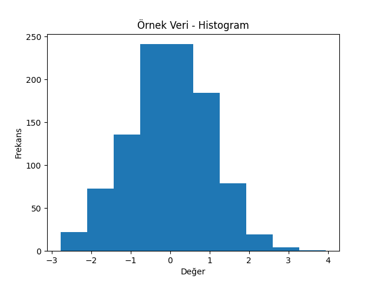

# Matplotlib Temelleri

Bu bölümde, Python’un en yaygın görselleştirme kütüphanelerinden biri olan **Matplotlib**’in temelleri ele alınmaktadır.
Matplotlib, veri görselleştirme sürecinde en çok kullanılan ve esnekliği yüksek bir araçtır.

---

## 🎯 Öğrenme Hedefleri

* Matplotlib kütüphanesini tanımak
* Temel grafik türlerini (çizgi, çubuk, dağılım) oluşturmak
* Başlık, eksen isimleri ve renk ayarlarını düzenlemek
* Grafik tasarımında özelleştirme yöntemlerini öğrenmek

---

## 📦 Matplotlib Nedir?

Matplotlib, Python’da veri görselleştirme için en temel kütüphanelerden biridir.
`matplotlib.pyplot` modülü genellikle **plt** kısaltmasıyla kullanılır ve grafik oluşturmak için yüksek seviyeli fonksiyonlar sağlar.

```python
import matplotlib.pyplot as plt
```

---

## 📈 Çizgi Grafiği Oluşturma

En basit grafik türlerinden biri çizgi grafiklerdir. Genellikle zaman serisi verileri veya eğilimleri göstermek için kullanılır.

```python
import matplotlib.pyplot as plt

aylar = ['Ocak', 'Şubat', 'Mart', 'Nisan', 'Mayıs']
satis = [120, 135, 160, 180, 200]

plt.plot(aylar, satis)
plt.title('Aylık Satış Grafiği')
plt.xlabel('Ay')
plt.ylabel('Satış (bin adet)')
plt.show()
```
  

> [!TIP]
> `marker='o'` parametresi ile veri noktalarına işaret ekleyebilirsiniz.

---

## 📊 Çubuk (Bar) Grafiği

Kategorik veriler arasındaki farkı göstermek için çubuk grafikleri kullanılır.

```python
departmanlar = ['Satış', 'Pazarlama', 'Üretim', 'AR-GE']
calisan_sayilari = [25, 18, 32, 15]

plt.bar(departmanlar, calisan_sayilari, color='#4e79a7')
plt.title('Departman Bazlı Çalışan Sayısı')
plt.ylabel('Kişi Sayısı')
plt.show()
```
  

> [!IMPORTANT]
> Dikey çubuk grafiği `plt.bar()`, yatay çubuk grafiği ise `plt.barh()` fonksiyonu ile oluşturulur.

---

## 🔵 Dağılım (Scatter) Grafiği

İki değişken arasındaki ilişkiyi görselleştirmek için kullanılır.

```python
x = [10, 20, 30, 40, 50]
y = [8, 15, 25, 35, 45]

plt.scatter(x, y, color='#e15759')
plt.title('Dağılım Grafiği')
plt.xlabel('Bağımsız Değişken')
plt.ylabel('Bağımlı Değişken')
plt.show()
```
  


## 📉 Histogram

Histogramlar, tek bir değişkenin değer dağılımını ve frekanslarını görselleştirmek için kullanılır. Sürekli verilerin yoğunluğunu görmek, çarpıklık (skew) ve çok modluluk (multimodality) gibi özellikleri hızlıca tespit etmek için idealdir. 

```python
import numpy as np
import matplotlib.pyplot as plt

# Örnek veri: normal dağılıma sahip rastgele veriler
data = np.random.normal(loc=0, scale=1, size=1000)

plt.hist(data, bins=10)
plt.title('Örnek Veri - Histogram')
plt.xlabel('Değer')
plt.ylabel('Frekans')
```
  

> [!TIP]
> `bins` sayısı grafiğin ayrıntı düzeyini kontrol eder.

## 🎨 Grafik Özelleştirme

Grafikleri daha okunabilir hale getirmek için çeşitli stil ayarları yapılabilir.

```python
plt.plot(aylar, satis, color='green', linestyle='--', marker='o', linewidth=2)
plt.title('Özelleştirilmiş Çizgi Grafiği', fontsize=14)
plt.xlabel('Ay', fontsize=12)
plt.ylabel('Satış (bin adet)', fontsize=12)
plt.grid(True, linestyle='--', alpha=0.6)
plt.show()
```
  

### Diğer Stil Özellikleri

* `color` → Renk (örneğin `'red'`, `'#4e79a7'`)
* `linestyle` → Çizgi tipi (`'-'`, `'--'`, `':'`)
* `marker` → Nokta işareti (`'o'`, `'s'`, `'d'`)
* `linewidth` → Çizgi kalınlığı

---

## 🧩 Birden Fazla Grafik (Subplots)

Birden fazla grafiği aynı figür üzerinde göstermek için `plt.subplot()` fonksiyonu kullanılabilir.

`plt.subplot(nrows, ncols, index)`: Bu fonksiyon, grafiğin yerleştirileceği bir alt alan (subplot) oluşturur. `nrows` ve `ncols` parametreleri, toplamda kaç satır ve sütun olacağını belirtirken, `index` ise hangi alt alanın kullanılacağını belirtir.

**Parametreler**:
- `nrows` (3): Toplam 3 satır olduğunu belirtir.
- `ncols` (2): Toplam 2 sütun olduğunu belirtir.
- `index` (5): Toplam 6 alt alandan 5. alt alanı seçer.

```python
plt.figure(figsize=(10, 4))

plt.subplot(1, 2, 1)
plt.plot(aylar, satis, color='blue')
plt.title('Çizgi Grafik')

plt.subplot(1, 2, 2)
plt.bar(aylar, satis, color='orange')
plt.title('Çubuk Grafik')

plt.tight_layout()
plt.show()
```
  

> [!NOTE]
> `figsize=(10, 4)`: Bu parametre, figürün boyutlarını inç (inches) cinsinden belirler.
> - **10**: Figürün genişliği (x ekseninin uzunluğu) 10 inç.
> - **4**: Figürün yüksekliği (y ekseninin uzunluğu) 4 inç.
> 
> `plt.tight_layout()`: Bu komut, alt alanların (subplots) düzenini otomatik olarak ayarlamak için kullanılır. Grafiklerdeki elemanların (başlıklar, etiketler, vb.) daha iyi görünmesi için boşlukları optimize eder.
> - **Kullanımı**: Genellikle çok sayıda alt alan veya etiket bulunduran grafiklerde, elemanlar birbirine girebilir. `tight_layout()`, bu durumda grafiğin daha düzgün görünmesini sağlar. Özellikle alt alanların arasındaki boşlukları ve dış kenar boşluklarını ayarlamak için etkilidir.

---

## ⚠️ Sık Yapılan Hatalar

* Eksensiz veya başlıksız grafik oluşturmak
* Renk kontrastlarını dikkate almamak
* Çok fazla veriyle karmaşık grafikler üretmek

---

## 📚 Ek Kaynaklar

* [Matplotlib Kullanım Kılavuzu](https://matplotlib.org/stable/users/getting_started/)
* [Matplotlib Stil Galerisi](https://matplotlib.org/stable/gallery/style_sheets/style_sheets_reference.html)
