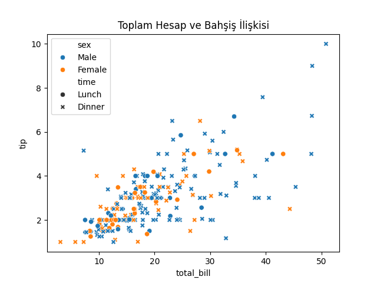
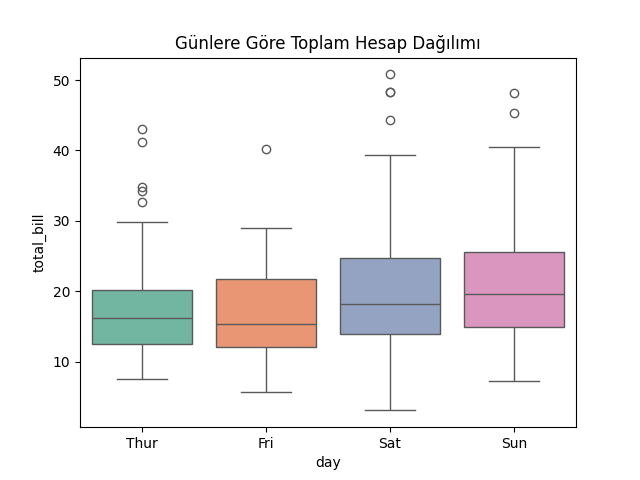
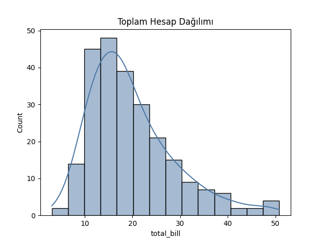

# Seaborn ile Veri Görselleştirme

Bu bölümde, Matplotlib üzerine inşa edilmiş gelişmiş bir kütüphane olan **Seaborn** tanıtılmaktadır.
Seaborn, istatistiksel veri görselleştirme için tasarlanmış olup, grafiklerin daha estetik ve bilgilendirici hale gelmesini sağlar.

---

## 🎯 Öğrenme Hedefleri

* Seaborn kütüphanesinin temel özelliklerini tanımak
* Temel grafik türlerini (histogram, boxplot, scatter, barplot) oluşturmak
* Veri setiyle doğrudan entegre çalışan fonksiyonları öğrenmek
* Renk paletleri ve temalarla görselleştirmeyi özelleştirmek

---

## 📦 Seaborn Nedir?

Seaborn, özellikle **pandas DataFrame** yapısıyla uyumlu çalışan, kolay ve estetik görselleştirmeler sunan bir kütüphanedir.
Matplotlib’e kıyasla daha az kodla daha açıklayıcı grafikler üretir.

```python
import seaborn as sns
import matplotlib.pyplot as plt
import pandas as pd
```

---

## 📊 Örnek Veri Seti

Seaborn, kendi içinde kullanıma hazır veri setleriyle birlikte gelir.

```python
df = sns.load_dataset('tips')
df.head()
```
| total_bill |   tip |    sex | smoker | day |  time  | size |
|-----------:|------:|--------|--------|-----|--------|-----:|
|      16.99 |  1.01 | Female | No     | Sun | Dinner |    2 |
|      10.34 |  1.66 | Male   | No     | Sun | Dinner |    3 |
|      21.01 |  3.50 | Male   | No     | Sun | Dinner |    3 |
|      23.68 |  3.31 | Male   | No     | Sun | Dinner |    2 |
|      24.59 |  3.61 | Female | No     | Sun | Dinner |    4 |

Bu veri seti, bir restoranın bahşiş (tip) verilerini içerir.

---

## 📈 Dağılım Grafiği (Scatter Plot)

```python
sns.scatterplot(data=df, x='total_bill', y='tip', hue='sex', style='time')
plt.title('Toplam Hesap ve Bahşiş İlişkisi')
```


> [!TIP]
> `hue` parametresi renkleri, `style` parametresi ise işaret tiplerini belirler.

---

## 📊 Kutu Grafiği (Box Plot)

Kutu grafikleri, veri dağılımı, medyan, çeyrekler ve uç değerleri görselleştirir.

```python
sns.boxplot(data=df, x='day', y='total_bill', palette='Set2')
plt.title('Günlere Göre Toplam Hesap Dağılımı')
```


> [!TIP]
> `palette` parametresiyle renk seti belirlenebilir (ör. `'Set1'`, `'coolwarm'`, `'viridis'`).

---

## 📉 Histogram ve Yoğunluk Grafiği

```python
sns.histplot(data=df, x='total_bill', kde=True, color='#4e79a7')
plt.title('Toplam Hesap Dağılımı')
```


> [!TIP]
> `kde=True` seçeneği, histogram üzerine bir yoğunluk eğrisi ekler.
> `bins=10` sayısı grafiğin ayrıntı düzeyini kontrol eder.

---

## 📈 Çizgi Grafiği (Line Plot)

Çizgi grafikleri zaman serileri veya sıralı/veri noktaları arasındaki trendleri göstermek için uygundur. Seaborn `lineplot` fonksiyonu, veri özetlerini otomatik olarak hesaplayıp (ör. ortalama) güven aralıklarını çizebilir.

```python
# Günlere göre ortalama total_bill çizimi
sns.lineplot(data=df, x='day', y='total_bill', marker='o', color='#2f6f9f')
plt.title('Günlere Göre Ortalama Toplam Hesap')
plt.xlabel('Gün')
plt.ylabel('Ortalama Toplam Hesap')
```


> [!TIP]
> - `marker` parametresiyle nokta işaretleri ekleyin.


## 📊 Çubuk Grafiği (Bar Plot)

```python
sns.barplot(data=df, x='day', y='tip', estimator='mean')
plt.title('Günlere Göre Ortalama Bahşiş Miktarı')
```


> [!TIP]
> Varsayılan olarak ortalama (`mean`) değerleri gösterir; `estimator` parametresi ile değiştirilebilir (ör. `median`).

---

## 🎨 Renk Paletleri ve Temalar

Seaborn, grafiklerin genel stilini belirlemek için birkaç tema sunar:

```python
sns.set_theme(style='whitegrid', palette='deep')
```

Diğer popüler temalar:

* `'darkgrid'`
* `'white'`
* `'ticks'`

> [!TIP]
> Palet seçenekleri: `'pastel'`, `'muted'`, `'deep'`, `'coolwarm'`, `'rocket'`, `'mako'`.

---

## ⚠️ Dikkat Edilmesi Gerekenler

* Renk seçimi ve kontrastı görsel algıyı doğrudan etkiler.
* Fazla sayıda değişkeni aynı grafiğe eklemek, anlamı azaltabilir.
* Temalar arası geçişte tutarlılık korunmalıdır.

---

## 📚 Ek Kaynaklar

* [Seaborn Resmî Belgeleri](https://seaborn.pydata.org/)
* [Seaborn Gallery](https://seaborn.pydata.org/examples/index.html)
* [Seaborn Palet Referansı](https://seaborn.pydata.org/tutorial/color_palettes.html)
