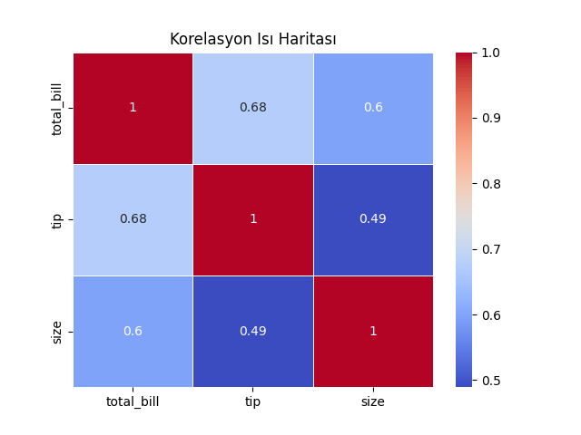
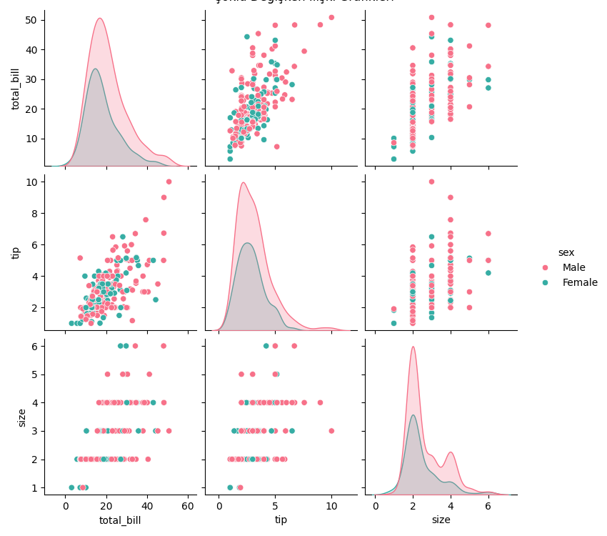
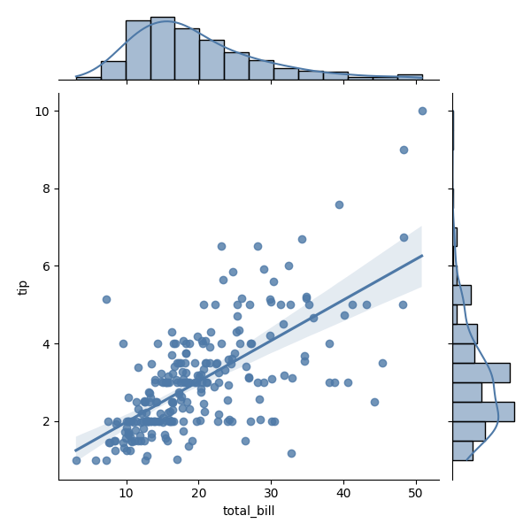
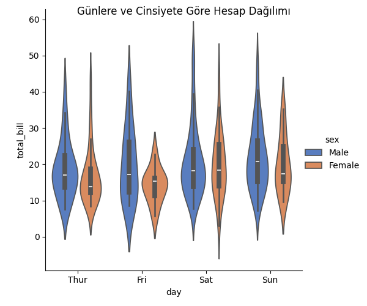
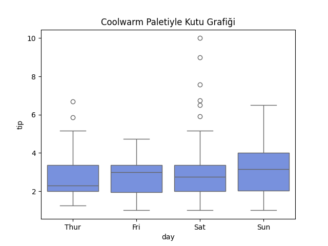
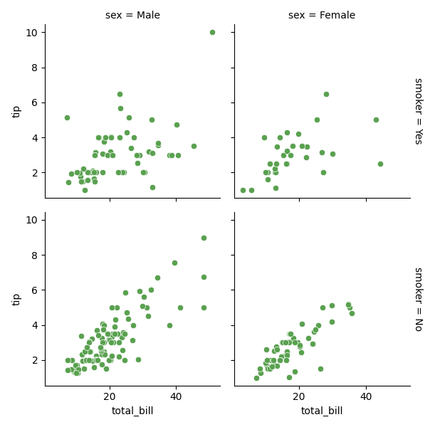

# Seaborn Gelişmiş Grafikler

Bu bölümde, Seaborn’un gelişmiş fonksiyonlarını kullanarak çok değişkenli ve istatistiksel açıdan zengin grafikler oluşturmayı öğreneceğiz.
Bu araçlar, veri ilişkilerini daha derinlemesine anlamamıza ve sunumlarda etkileyici görselleştirmeler yapmamıza olanak tanır.

---

## 🎯 Öğrenme Hedefleri

* Çok değişkenli grafikler (pairplot, catplot, jointplot) oluşturmak
* Isı haritaları (heatmap) ile korelasyonları görselleştirmek
* Gelişmiş renk paletleri ve düzenlemeler kullanmak
* Grafik yorumlarını istatistiksel olarak güçlendirmek

---

## 📊 Korelasyon Isı Haritası (Heatmap)

Isı haritaları, değişkenler arasındaki korelasyonları görsel olarak temsil eder. Renk tonları ilişkilerin gücünü ifade eder.

```python
import seaborn as sns
import matplotlib.pyplot as plt

df = sns.load_dataset('tips')

corr = df.corr(numeric_only=True)
sns.heatmap(corr, annot=True, cmap='coolwarm', linewidths=0.5)
plt.title('Korelasyon Isı Haritası')
```


> [!TIP]
> `annot=True` parametresiyle hücrelere korelasyon katsayıları eklenir.

---

## 📈 İlişki Grafikleri (Pairplot)

Pairplot, veri setindeki tüm sayısal değişkenlerin birbirleriyle ilişkilerini aynı anda gösterir.

```python
sns.pairplot(df, hue='sex', diag_kind='kde', palette='husl')
plt.suptitle('Çoklu Değişken İlişki Grafikleri', y=1.02)
```


>[!NOTE]
> - `hue` parametresi, kategorik bir değişkene göre renk ayrımı sağlar.  
> - `diag_kind='kde'` seçeneği, diyagonal kısımda yoğunluk eğrileri gösterir.

---

## 📉 Birleşik Grafikler (Jointplot)

Jointplot, iki değişkenin hem dağılımını hem de ilişkisini tek bir grafik üzerinde gösterir.

```python
sns.jointplot(data=df, x='total_bill', y='tip', kind='reg', color='#4e79a7')
```


>[!NOTE]
> `kind` parametresi: `'scatter'`, `'hex'`, `'reg'`, `'kde'` gibi türleri destekler.

---

## 🧮 Kategorik Grafikler (Catplot)

Catplot, farklı kategoriler arasındaki farkları çok boyutlu şekilde gösterebilen bir üst düzey fonksiyondur.

```python
sns.catplot(data=df, x='day', y='total_bill', hue='sex', kind='violin', palette='muted')
plt.suptitle('Günlere ve Cinsiyete Göre Hesap Dağılımı')
```


>[!NOTE]
> `kind` parametresi `'strip'`, `'swarm'`, `'box'`, `'violin'`, `'bar'` gibi birçok grafik türünü destekler.

---

## 🎨 Renk Paletleri ve Estetik Ayarlar

Seaborn, gelişmiş renk paletleri sunar. Palet seçimi görsel algıyı doğrudan etkiler.

```python
sns.set_palette('coolwarm')

sns.boxplot(data=df, x='day', y='tip')
plt.title('Coolwarm Paletiyle Kutu Grafiği')
```


>[!NOTE]
> **Alternatif paletler**: `'viridis'`, `'crest'`, `'flare'`, `'mako'`, `'icefire'`, `'rocket'`.

---

## 🧭 FacetGrid ile Çoklu Görselleştirme

Birden fazla alt grafiği kategori bazında oluşturmak için `FacetGrid` kullanılabilir.

```python
g = sns.FacetGrid(df, col='sex', row='smoker', margin_titles=True)
g.map_dataframe(sns.scatterplot, x='total_bill', y='tip', color='#59a14f')
g.add_legend()
```


> [!TIP]
> Bu yöntem, alt gruplar bazında veri ilişkilerini karşılaştırmak için oldukça etkilidir.

---

## ⚠️ Dikkat Edilmesi Gerekenler

* Çok fazla değişkeni aynı anda göstermek, bilgi karmaşasına neden olabilir.
* Renk paletleri ve grafik türleri verinin doğasına uygun seçilmelidir.
* FacetGrid kullanırken yeterli alan (figure size) bırakılmalıdır.

---

## 📚 Ek Kaynaklar

* [Seaborn Relational Plots](https://seaborn.pydata.org/tutorial/relational.html)
* [Seaborn Categorical Plots](https://seaborn.pydata.org/tutorial/categorical.html)