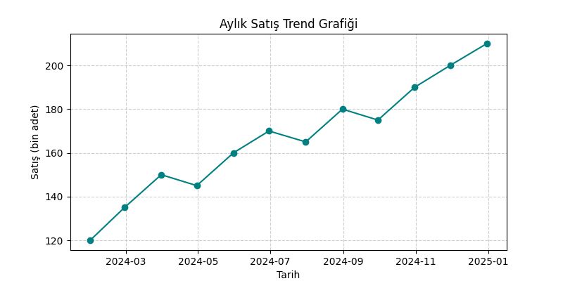
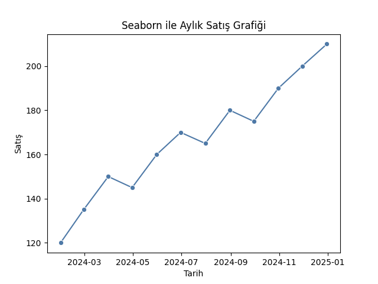
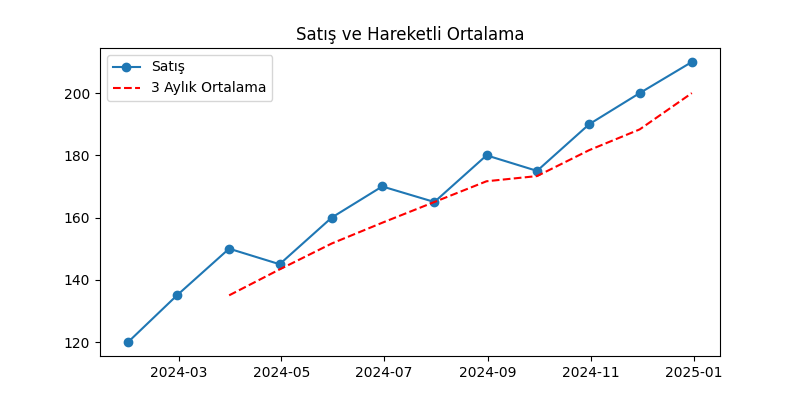
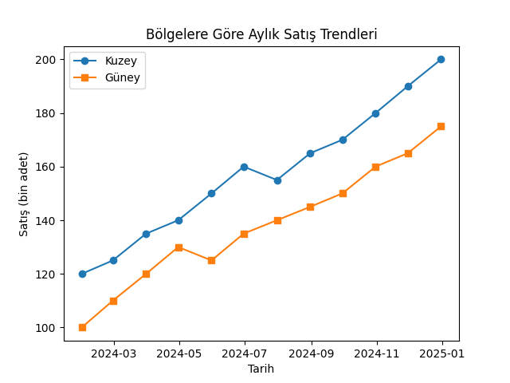
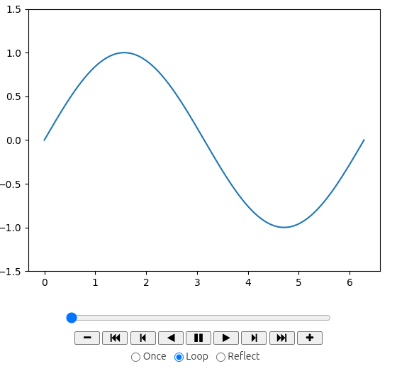
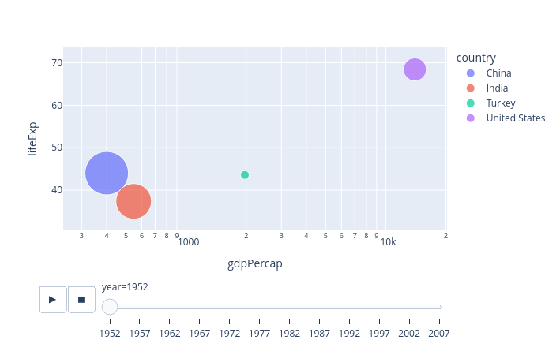
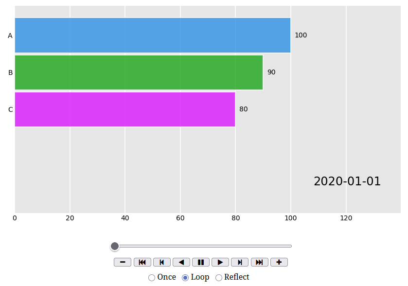

# Zamana Bağlı Görselleştirmeler (Time Series Visualization)

Bu bölümde, zaman serisi verilerinin görselleştirilmesi ele alınmaktadır.
Zamana bağlı veriler; trend, mevsimsellik, döngüsellik gibi desenler içerdiği için özel analiz teknikleri ve uygun grafik türleriyle sunulmalıdır. Ayrıca bu ünitede **animasyonlu grafikler** ve **yarışan grafik (bar chart race)** örnekleri de gösterilecektir.

---

## 🎯 Öğrenme Hedefleri

* Zaman serisi kavramını ve özelliklerini anlamak
* pandas ile tarih verilerini işlemek
* Matplotlib, Seaborn ve Plotly ile zaman serisi grafikleri oluşturmak
* Animasyonlu grafikler ve bar chart race oluşturmayı öğrenmek

---

## 🧭 Zaman Serisi Nedir?

**Zaman serisi**, belirli zaman aralıklarında kaydedilen gözlemlerden oluşan veri türüdür.
Örnek: günlük sıcaklık, aylık satış miktarı, yıllık nüfus artışı.

Zaman serilerinin üç temel bileşeni vardır:

* **Trend:** Uzun dönemli artış veya azalış eğilimi
* **Mevsimsellik:** Belirli dönemlerde tekrar eden değişimler
* **Rastgelelik:** Öngörülemeyen dalgalanmalar

---

## 🧩 Tarih Verilerini Hazırlama

Zaman serisi analizlerinde tarih sütunu genellikle **datetime** tipine dönüştürülür.

```python
import pandas as pd

# Örnek veri
veri = {
    'Tarih': pd.date_range(start='2024-01-01', periods=12, freq='M'),
    'Satış': [120, 135, 150, 145, 160, 170, 165, 180, 175, 190, 200, 210]
}

df = pd.DataFrame(veri)
df.info()
```

> `pd.date_range()` fonksiyonu otomatik olarak ardışık tarih dizileri oluşturur.

---

## 📈 Matplotlib ile Zaman Serisi Grafiği

```python
import matplotlib.pyplot as plt

plt.figure(figsize=(8, 4))
plt.plot(df['Tarih'], df['Satış'], marker='o', linestyle='-', color='teal')
plt.title('Aylık Satış Trend Grafiği')
plt.xlabel('Tarih')
plt.ylabel('Satış (bin adet)')
plt.grid(True, linestyle='--', alpha=0.6)
```


> [!TIP]
> Zaman serilerinde x ekseni genellikle tarih bilgisini içerir.

---

## 📊 Seaborn ile Zaman Serisi Grafiği

```python
import seaborn as sns

sns.lineplot(data=df, x='Tarih', y='Satış', marker='o', color='#4e79a7')
plt.title('Seaborn ile Aylık Satış Grafiği')
```


> [!TIP]
> Seaborn, tarih tipindeki sütunları otomatik olarak tanır ve eksen biçimlendirmesini ayarlar.

---

## 📆 Tarihe Göre Gruplama

Veri yıllık, aylık veya haftalık olarak özetlenebilir.

```python
df['Yıl'] = df['Tarih'].dt.year
df['Ay'] = df['Tarih'].dt.month

yillik_ortalama = df.groupby('Yıl')['Satış'].mean()
print(yillik_ortalama)
```
Yıl  
2024    166.666667  
Name: Satış, dtype: float64

> [!TIP]
> `dt` özellikleri (`.year`, `.month`, `.day`, `.weekday`) tarih bileşenlerini kolayca ayırmayı sağlar.

---

## 🔍 Trend ve Hareketli Ortalama

Zaman serilerinde dalgalanmaları yumuşatmak için hareketli ortalama (moving average) sıkça kullanılır.

```python
df['Hareketli_Ortalama'] = df['Satış'].rolling(window=3).mean()

plt.figure(figsize=(8,4))
plt.plot(df['Tarih'], df['Satış'], label='Satış', marker='o')
plt.plot(df['Tarih'], df['Hareketli_Ortalama'], label='3 Aylık Ortalama', linestyle='--', color='red')
plt.title('Satış ve Hareketli Ortalama')
plt.legend()
```


> [!TIP]
> `rolling(window=3)` üç dönemlik ortalama alır. Pencere boyutu veriye göre ayarlanabilir.

---

## 🕒 Zamana Bağlı Çoklu Seri Grafiği

Birden fazla kategoriyi zamana göre karşılaştırmak mümkündür.

```python
veri2 = {
    'Tarih': pd.date_range(start='2024-01-01', periods=12, freq='M'),
    'Kuzey': [120, 125, 135, 140, 150, 160, 155, 165, 170, 180, 190, 200],
    'Güney': [100, 110, 120, 130, 125, 135, 140, 145, 150, 160, 165, 175]
}

df2 = pd.DataFrame(veri2)

plt.plot(df2['Tarih'], df2['Kuzey'], label='Kuzey', marker='o')
plt.plot(df2['Tarih'], df2['Güney'], label='Güney', marker='s')
plt.title('Bölgelere Göre Aylık Satış Trendleri')
plt.xlabel('Tarih')
plt.ylabel('Satış (bin adet)')
plt.legend()
```



---

## ✨ Animasyonlu Grafikler

Animasyonlu grafikler, zamanla değişen verileri görsel olarak canlandırmak için kullanışlıdır. Aşağıda **Matplotlib** ile basit bir animasyon örneği ve **Plotly** ile etkileşimli animasyon örneği verilmiştir.

### Matplotlib `FuncAnimation` örneği

```python
import numpy as np
import matplotlib.pyplot as plt
from matplotlib.animation import FuncAnimation

# Örnek: Zamanla değişen sinüs dalgası
fig, ax = plt.subplots()
x = np.linspace(0, 2*np.pi, 200)
line, = ax.plot(x, np.sin(x))
ax.set_ylim(-1.5, 1.5)

def update(frame):
    line.set_ydata(np.sin(x + frame/10))
    return line,

ani = FuncAnimation(fig, update, frames=100, interval=50)

# Jupyter'de görüntülemek için:
from IPython.display import HTML
HTML(ani.to_jshtml())

# Alternatif olarak animasyonu GIF veya MP4 olarak kaydetmek için:
# ani.save('sine_wave.mp4', writer='ffmpeg', dpi=150)
```



> [!Note]
> MP4/GIF kaydetme için sistemde `ffmpeg` veya `imagemagick` yüklü olmalıdır. Jupyter içinde hızlı önizleme için `to_jshtml()` kullanılabilir.

---

### Plotly Express ile animasyonlu scatter örneği

Plotly, interaktif ve animasyonlu grafikleri çok kolay oluşturmanızı sağlar. Aşağıdaki örnek aslında `gapminder` benzeri veri setlerinde kullanılır:

```python
import plotly.express as px

df_gap = px.data.gapminder().query("country in ['Turkey','United States','China','India']")
fig = px.scatter(df_gap, x='gdpPercap', y='lifeExp', animation_frame='year', animation_group='country',
                 size='pop', color='country', hover_name='country', log_x=True, size_max=60)
fig.show()
```


> [!Note]
> Plotly grafikleri JupyterLab/Colab'da interaktif şekilde oynatılabilir ve HTML olarak kaydedilebilir.

---

## 🏁 Yarışan Grafik (Bar Chart Race)

Bar chart race, kategorilerin zaman içinde nasıl yer değiştirdiğini ve sıralamada nasıl ilerlediğini gösteren popüler bir animasyon türüdür. `bar_chart_race` kütüphanesi bu iş için pratik bir araçtır.

### Basit `bar_chart_race` örneği

```python
# Kurulum (gerekirse): pip install bar_chart_race
import bar_chart_race as bcr
import pandas as pd

# Örnek veri: index = tarih, sütunlar = kategoriler
data = pd.DataFrame({
    '2020-01': {'A': 100, 'B': 90, 'C': 80},
    '2020-02': {'A': 110, 'B': 95, 'C': 85},
    '2020-03': {'A': 120, 'B': 100, 'C': 90},
}).T

data.index = pd.to_datetime(data.index)

# HTML olarak kaydetme veya doğrudan Jupyter'de oynatma
bcr.bar_chart_race(df=data, filename='bar_chart_race.html', orientation='h', sort='desc',
                   n_bars=5, fixed_order=False, fixed_max=True, steps_per_period=10, interpolate_period=False)
```


> [!Tip]
> `bar_chart_race` çıktısı HTML/MP4 olarak kaydedilebilir; Jupyter içinde doğrudan gösterilebilir.

### Covid-19 Verileriyle Yarışan Grafik

```python
import pandas as pd
import bar_chart_race as bcr

df=pd.read_csv("05-Advanced-Visualization/corona_dat.csv")
df2=df[['date','China','Italy','Brazil','Spain','US','Turkey']]
df2.set_index("date", inplace=True)
toplam=df2.cumsum(axis=0)

bcr.bar_chart_race(toplam,filename='covid19.mp4',figsize=(10,8),title='Covid19')
```


<video src="covid19.mp4"></video>
---

## ⚠️ Dikkat Edilmesi Gerekenler

* Animasyonlar sunum ve web için etkileyicidir, ancak statik raporlarda kullanımı sınırlıdır.
* Büyük veri setlerinde animasyon performansı düşebilir — örneklem veya özetleme gerekebilir.
* Bar chart race ve benzeri animasyonlarda renk, etiket ve zaman etiketi (timestamp) görünürlüğü önemlidir.

---

## 📚 Ek Kaynaklar

* [Matplotlib Animation Guide](https://matplotlib.org/stable/api/animation_api.html)
* [Plotly Animations](https://plotly.com/python/animations/)
* [bar_chart_race GitHub](https://github.com/dexplo/bar_chart_race)
