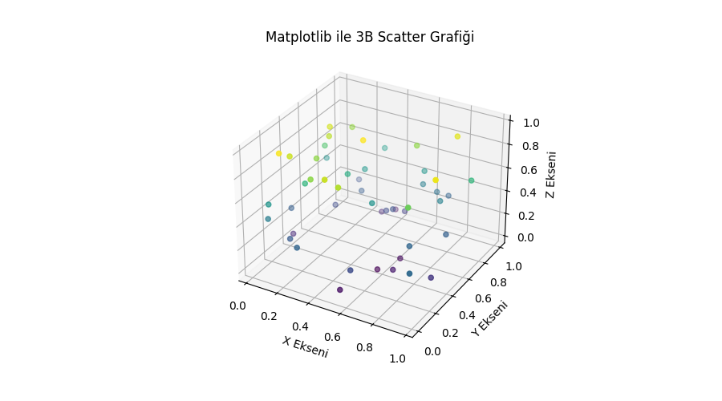
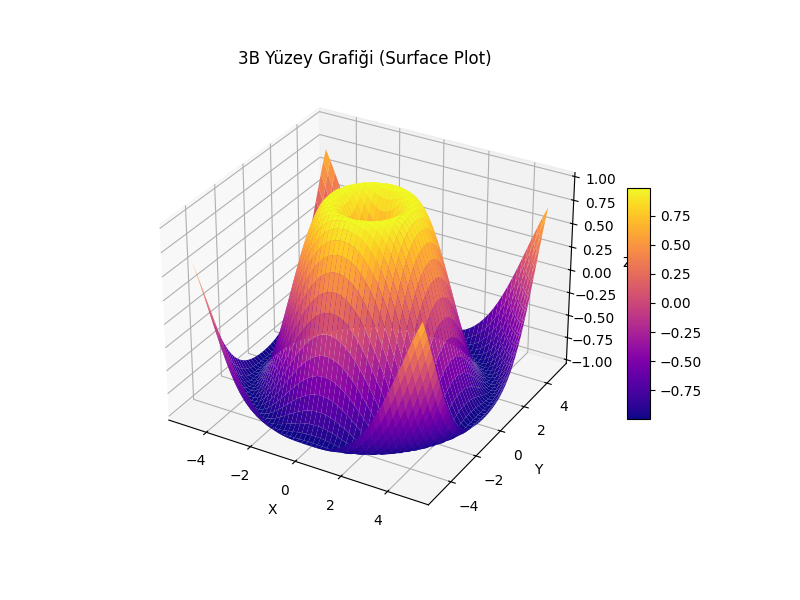
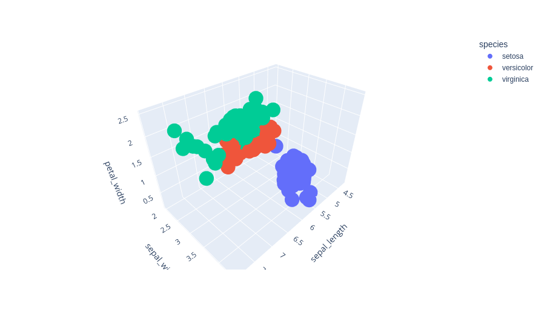
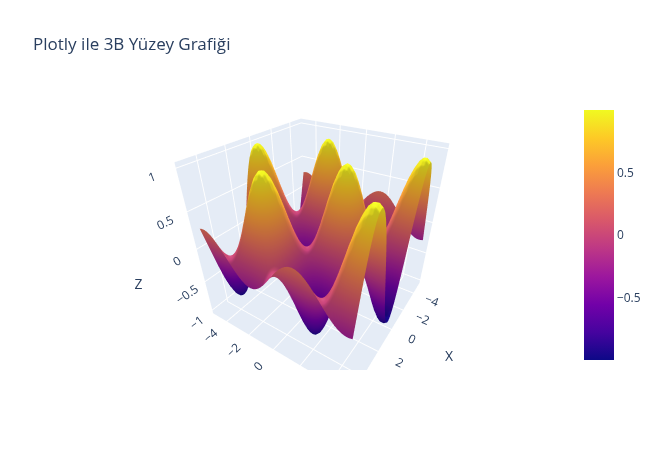

# 3B Görselleştirmeler (3D Visualization)

Bu bölümde, **üç boyutlu (3D) veri görselleştirme** teknikleri ele alınmaktadır.
3B grafikler; iki değişken arasındaki ilişkiye ek olarak üçüncü bir değişkenin de görsel olarak ifade edilmesini sağlar. Özellikle yüzey analizi, uzamsal ilişkiler ve karmaşık veri yapılarının keşfedilmesinde kullanılır.

---

## 🎯 Öğrenme Hedefleri

Bu bölümün sonunda okuyucu:

* Matplotlib kullanarak temel 3B grafikler oluşturabilir,
* 3B scatter ve yüzey (surface) grafiklerinin hangi durumlarda tercih edilmesi gerektiğini bilir,
* Plotly ile etkileşimli 3B grafikler çizebilir,
* Gerçek veya simüle edilmiş verilerden 3B yüzey grafikleri üretebilir.

---

## 📦 Kullanılan Kütüphaneler

```python
import numpy as np
import pandas as pd
import matplotlib.pyplot as plt
from mpl_toolkits.mplot3d import Axes3D
import plotly.express as px
import plotly.graph_objects as go
```

---

## 1️⃣ Matplotlib ile 3B Grafikler (Axes3D)

Matplotlib, `mpl_toolkits.mplot3d` modülü aracılığıyla 3B görselleştirmeleri destekler.

### 🔹 3B Scatter Grafiği

```python
import numpy as np
import matplotlib.pyplot as plt
from mpl_toolkits.mplot3d import Axes3D

np.random.seed(42)
x = np.random.rand(50)
y = np.random.rand(50)
z = np.random.rand(50)

fig = plt.figure(figsize=(7,5))
ax = fig.add_subplot(111, projection='3d')

ax.scatter(x, y, z, c=z, cmap='viridis')
ax.set_xlabel('X Ekseni')
ax.set_ylabel('Y Ekseni')
ax.set_zlabel('Z Ekseni')
ax.set_title('Matplotlib ile 3B Scatter Grafiği')
```


> [!Tip]
> 📌 **Kullanım Alanları:**
> - Üç değişken arasındaki ilişkilerin keşfi
> - Küme yapılarının görselleştirilmesi

---

## 2️⃣ Matplotlib ile 3B Yüzey (Surface) Grafiği

Yüzey grafikleri, genellikle **iki bağımsız değişken ve bir bağımlı değişken** içeren matematiksel veya fiziksel modellerin görselleştirilmesinde kullanılır.

```python
x = np.linspace(-5, 5, 50)
y = np.linspace(-5, 5, 50)
X, Y = np.meshgrid(x, y)
Z = np.sin(np.sqrt(X**2 + Y**2))

fig = plt.figure(figsize=(8,6))
ax = fig.add_subplot(111, projection='3d')

surface = ax.plot_surface(X, Y, Z, cmap='plasma')
fig.colorbar(surface, shrink=0.5, aspect=10)

ax.set_title('3B Yüzey Grafiği (Surface Plot)')
ax.set_xlabel('X')
ax.set_ylabel('Y')
ax.set_zlabel('Z')
```


> [!Note]
> 📌 **Not:** Matplotlib yüzey grafikleri statiktir; etkileşim sınırlıdır.

---

## 3️⃣ Plotly ile Etkileşimli 3B Scatter Grafikleri

Plotly, 3B grafiklerde **döndürme, yakınlaştırma ve etkileşim** imkânı sunar.

```python
import plotly.express as px

df = px.data.iris()

fig = px.scatter_3d(df,
                    x='sepal_length',
                    y='sepal_width',
                    z='petal_length',
                    color='species',
                    title='Plotly ile Etkileşimli 3B Scatter')
fig.show()
```


> [!Note]
> 📌 **Avantajlar:**
> * Web tabanlı ve etkileşimli
> * HTML olarak dışa aktarılabilir

---

## 4️⃣ Plotly ile 3B Yüzey (Surface) Grafiği

```python
import plotly.graph_objects as go

x = np.linspace(-5, 5, 50)
y = np.linspace(-5, 5, 50)
X, Y = np.meshgrid(x, y)
Z = np.cos(X) * np.sin(Y)

fig = go.Figure(data=[go.Surface(z=Z, x=X, y=Y)])

fig.update_layout(title='Plotly ile 3B Yüzey Grafiği',
                  scene=dict(
                      xaxis_title='X',
                      yaxis_title='Y',
                      zaxis_title='Z'))

fig.show()
```
 
---

## 5️⃣ Gerçek Verilerle 3B Yüzey Oluşturma

Gerçek verilerle çalışırken genellikle ölçümler **grid (ızgara)** formunda değildir. Bu durumda:

* Veriler yeniden şekillendirilir (`pivot`, `groupby`),
* Eksik noktalar interpolasyonla doldurulabilir.

### 🔹 Örnek Senaryo

* X: Yaş
* Y: Boy
* Z: Kilo

Bu tür verilerle oluşturulan 3B yüzeyler, **antropometrik analiz**, **mühendislik** ve **eğitim araştırmaları** için değerlidir.

---

## ⚠️ 3B Grafik Kullanırken Dikkat Edilmesi Gerekenler

* 3B grafikler her zaman daha anlaşılır değildir.
* Perspektif yanılsaması oluşabilir.
* Alternatif olarak çoklu 2B grafikler veya etkileşimli görseller düşünülmelidir.

---

## ✅ Özet

* Matplotlib → Statik ve akademik 3B grafikler
* Plotly → Etkileşimli ve web uyumlu 3B grafikler
* Yüzey grafikleri → Fonksiyonel ve sürekli veriler için idealdir

Bir sonraki bölümde **Coğrafi Görselleştirmeler (Geographical Visualization)** ele alınacaktır.
